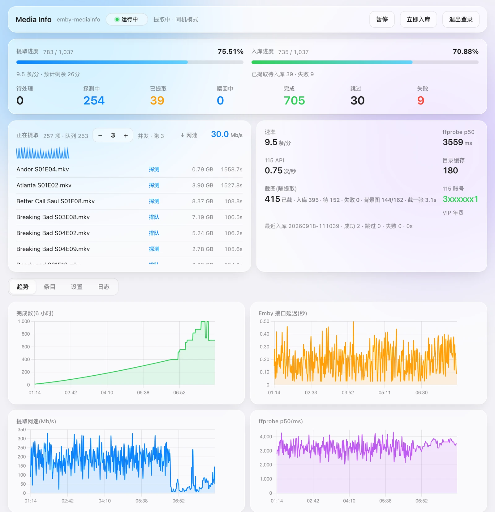
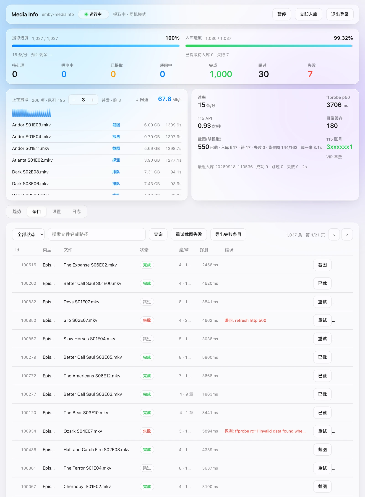
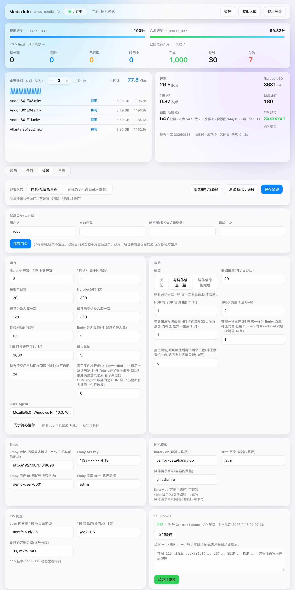
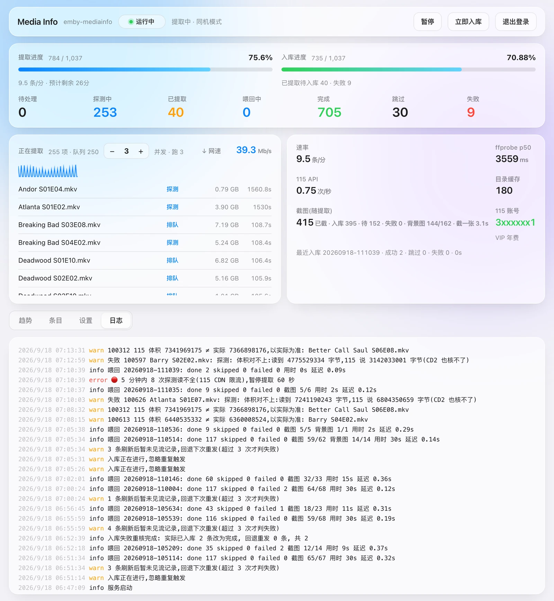

<div align="center">


# emby-mediainfo

**把 Emby 的媒体信息提取(ffprobe)从 Emby 里搬出去。**

[](LICENSE)
[](Dockerfile)
[](Dockerfile)

</div>

用 115 网盘的 cookie 直接取直链,在一个独立容器里跑 ffprobe,生成与 [StrmAssistant(神医助手)](https://github.com/sjtuross/StrmAssistant) 「媒体信息持久化」**逐字段一致**的 `-mediainfo.json`,写进「媒体信息」目录,再让插件原生恢复入库。

**Emby 全程不跑 ffprobe** —— 不占它的提取槽、不抢库写锁、不因为一个坏文件卡住整个队列。缺封面的条目顺带截图,做法和 Emby 原生一致。



<details>
<summary><b>更多界面(条目 / 设置 / 日志)</b></summary>

条目页 —— 每条的状态、耗时、流数/章节数,失败的直接显示原因:



设置页 —— 所有旋钮都带说明和取值范围,不用翻文档:



日志页:



</details>

---

## 目录

- [它解决什么问题](#它解决什么问题)
- [它是怎么做的](#它是怎么做的)
- [开始之前](#开始之前)
- [安装](#安装)
- [第一次配置(走一遍)](#第一次配置走一遍)
- [怎么确认它真的在干活](#怎么确认它真的在干活)
- [日常操作](#日常操作)
- [升级 / 备份 / 不想用了](#升级--备份--不想用了)
- [设置项逐个说明](#设置项逐个说明)
- [出问题了怎么查](#出问题了怎么查)
- [安全](#安全)
- [已知限制](#已知限制)
- [常见问题](#常见问题)

---

## 它解决什么问题

strm 库(网盘挂载)有个绕不开的矛盾:媒体信息必须靠 ffprobe 读文件头,而文件在网盘上。让 Emby 自己去读,意味着:

- Emby 的提取线程被网络 IO 占着,一个慢文件能堵住整条队列
- 提取和刮削抢同一个 `library.db` 写锁
- 想控制网盘并发?没有旋钮
- 跑一半 Emby 重启,进度归零

这个项目把这件事拿出来单独做:**可控的并发、可中断续跑、失败可查、进度看得见**,而产出的东西 Emby 那边认不出区别。

## 它是怎么做的

```
                 ┌─────────────── 这个容器 ───────────────┐
Emby library.db  │                                        │
  (只读快照) ──→ │ 1. 算出哪些条目缺媒体信息               │
                 │ 2. 115 cookie → 解析路径 → 取直链       │
115 网盘 ────────│ 3. ffprobe 直链 → 生成 sidecar json     │
                 │ 4. 缺封面的顺带截一张图                 │
                 └────────────────┬───────────────────────┘
                                  │ 写文件 + 调 Emby API
                                  ▼
          「媒体信息」目录 ──→ 神医助手原生恢复 ──→ Emby 入库
```

几个关键设计,都是踩出来的:

- **sidecar 格式逐字段对齐插件产出**。映射规则是从大量真实插件产出里统计的,并用 100 份样本做了逐字段双向比对(含「这个字段该不该存在」),100% 一致。改动映射逻辑后必须重跑这个对账。
- **115 只走 cookie(web API)**,和 CloudDrive2 / 开放平台的配额互相独立。全局串行限速 + 403/405/429 熔断 + 断点续跑。
- **分类树缓存**:115 的接口大约 1 次/秒,逐条查目录会慢到不可接受。改成一次递归列举整个分类(每页 1150 条)缓存起来,把「每条 2 次 API」压成「每千条 1 次」。
- **状态机 + 幂等**:每条只有一个状态且只往前走;入库按具体 id 打包、对端逐条复核(查到流记录才算完成);中断就整批回退重发。
- **不可靠的东西都留退路**:网盘给的体积会是错的 → 以实际读到的为准;Emby 的刷新是异步排队的 → 复核要重试;ISO 走不了 HTTP → 用本地挂载读。

---

## 开始之前

你需要:

| | |
|---|---|
| **Emby** | 装了 [StrmAssistant](https://github.com/sjtuross/StrmAssistant),并且开启了「媒体信息持久化」 |
| **一个 strm 媒体库** | 每个 `.strm` 文件里是一行网盘路径 |
| **115 网盘 cookie** | 浏览器登录 115 后从开发者工具里取,要含 `UID=` 和 `CID=` |
| **Docker** | 任何能跑 docker 的地方 |

⚠️ **先确认插件那边开着「媒体信息持久化」**,并且知道它的「媒体信息」根目录在哪 —— 这个项目就是往那个目录里写东西。插件设置里叫 `MediaInfoJsonRootFolder`。

### 两种部署模式,先想清楚用哪个

**同机模式**(容器和 Emby 在同一台机器)—— 推荐,简单
- 需要把三个目录挂进容器:「媒体信息」根目录(读写)、strm 根目录(读写,截图要写到 strm 旁边)、Emby 的 `data` 目录(只读,里面有 `library.db`)

**远程模式**(Emby 在另一台机器)
- 容器只需要能 SSH 到 Emby 那台机器,程序会把一个单文件脚本推过去执行(对端只要有 `python3`,不装任何依赖)
- 不需要挂载任何 Emby 的目录

---

## 安装

### Docker

```bash
git clone https://github.com/xiao-vvv/emby-mediainfo.git
cd emby-mediainfo
docker build -t emby-mediainfo .

docker run -d --name emby-mediainfo \
  -p 127.0.0.1:8000:8000 \
  -v /path/to/appdata:/config \
  -e MODE=local \
  -e EMBY_URL=http://宿主机IP:8096 \
  -v /path/to/emby/config/data:/emby-data:ro \
  -v /path/to/strm:/strm \
  -v /path/to/mediainfo:/mediainfo \
  emby-mediainfo
```

⚠️ **几个一上来就会踩的**:

- **`EMBY_URL` 不能填 `127.0.0.1`** —— 桥接网络里那是容器自己。填宿主机 IP,或者加 `--network=host`。
- **`-p` 建议绑 `127.0.0.1`** —— 这个端口能改 115 cookie、能 SSH 到你的 Emby 主机,别对着局域网敞开。
- **`library.db` 用只读挂载时,Emby 必须是运行状态**。Emby 用 WAL,只读目录下 sqlite 需要能碰到 `-wal`/`-shm` 文件;Emby 干净关停后这两个文件不在,会报「attempt to write a readonly database」—— 那不是权限问题,把 Emby 起起来就好。
- **「媒体信息」目录必须挂成可写**,而且**必须真的挂上**。没挂上的话程序会拒绝写入并整批退回(而不是在容器自己的盘上建一棵假的目录树)。

### docker compose

仓库里有现成的 [`docker-compose.yml`](docker-compose.yml),改完里面的路径直接 `docker compose up -d --build`:

```yaml
services:
  emby-mediainfo:
    build: .
    container_name: emby-mediainfo
    restart: unless-stopped
    ports: ["127.0.0.1:8000:8000"]
    environment:
      MODE: local
      EMBY_URL: http://192.168.1.10:8096
    volumes:
      - ./config:/config
      - /path/to/emby/config/data:/emby-data:ro
      - /path/to/strm:/strm
      - /path/to/mediainfo:/mediainfo
```

### 远程模式

不需要挂 Emby 的任何目录:

```bash
docker run -d --name emby-mediainfo \
  -p 127.0.0.1:8000:8000 \
  -v /path/to/appdata:/config \
  -e MODE=ssh \
  emby-mediainfo
```

SSH 的主机/端口/用户在 WebUI 里填,密钥也在 WebUI 里生成。

---

## 第一次配置(走一遍)

打开 `http://<地址>:8000`。首页顶上会有一条红色提示:**还没设登录口令**。

### 1. 设一个登录口令

**设置** → 最上面的「登录口令」卡片 → 填用户名(默认 `root`)和密码 → **保存口令**。

> 没设口令之前,任何能访问这个端口的人都能改你的 115 cookie、能 SSH 到你的 Emby 主机。先做这一步。

### 2. 填 Emby 连接

**设置** → `Emby` 分组:

| 字段 | 填什么 |
|---|---|
| Emby 地址 | 同机模式填 Emby 的地址;**远程模式填「从 Emby 那台机器上看」的地址**,通常就是 `http://127.0.0.1:8096` |
| Emby API key | Emby 后台 → 高级 → API 密钥 → 新建 |
| Emby 用户 Id | 先留空,点下面的「测试 Emby 连接」会列出用户让你选 |
| Emby 库里 strm 路径前缀 | **Emby 自己看到的** strm 路径前缀。比如 Emby 里条目的 Path 是 `/strm/剧集/xxx.strm`,这里就填 `/strm` |

点 **测试 Emby 连接**。连上了会显示服务器名和用户列表。

### 3. 填路径

**同机模式** → `同机模式` 分组:

| 字段 | 填什么 |
|---|---|
| library.db | 容器内路径,按上面的挂载就是 `/emby-data/library.db` |
| strm 目录 | 容器内路径,`/strm`。这是上一步那个「Emby 看到的前缀」在**本机**对应的真实目录 |
| 媒体信息目录 | 容器内路径,`/mediainfo`。就是插件的 `MediaInfoJsonRootFolder` |

**远程模式** → `远程模式` 分组:填 SSH 主机/端口/用户,点 **生成密钥**,把显示出来的公钥加到对方的 `~/.ssh/authorized_keys`。然后填对端的三个路径(**对端机器上的真实路径**,不是容器内路径)。

点 **测试主机与路径**,三个路径都应该是绿的。

> ⚠️ 这里最容易错的是「Emby 库里 strm 路径前缀」和「strm 目录」的对应关系。前者是 Emby 眼里的路径,后者是同一批文件在本机/对端的真实位置。填错的话同步会报「候选 0 条,读不到 strm N 条」。

### 4. 填 115

**设置** → `115 网盘` 分组:

| 字段 | 填什么 |
|---|---|
| strm 内容里 115 根目录前缀 | 打开任意一个 `.strm` 文件看里面那行路径。比如内容是 `/mnt/cloud/115/影视/电影/x.mkv`,而 `/mnt/cloud/115` 是你的 115 挂载点,那这里就填 `/mnt/cloud/115` |
| 115 挂载(仅 ISO) | 可选。只有蓝光 ISO 需要(它走不了 HTTP 直链),填容器内的 115 挂载路径 |
| 跳过的容器后缀 | 默认 `.ts,.m2ts,.mts`,和插件的默认排除项一致 |

然后在 **115 Cookie** 卡片里粘贴 cookie,点 **验证并替换**。验证通过会显示账号和 VIP 状态。

<details>
<summary><b>怎么取 115 的 cookie</b></summary>

1. 浏览器登录 <https://115.com>
2. F12 打开开发者工具 → **网络(Network)** 面板 → 刷新页面
3. 在请求列表里随便点一个发往 `115.com` 的请求 → 右边 **标头(Headers)** → 请求标头里找 `Cookie:`
4. 把 `Cookie:` 后面**整行**复制下来,粘进卡片里

必须含 `UID=`、`CID=`、`SEID=` 这几项(少了其中任何一个都调不通接口)。格式就是普通的一行:

```
UID=xxxxxxx_A1_xxxxxxxxxx; CID=xxxxxxxxxxxxxxxxxxxxxxxxxxxxxxxx; SEID=xxxx...; KID=xxxx...
```

⚠️ 几个注意:

- **别用手机 App 抓的 cookie**,和网页端不是一套。
- **cookie 会过期**(几周到几个月不等)。过期后程序会熔断并提示「登录失效,请更换 cookie」,这种不会自动恢复,换完点一下「重置熔断」。
- **在别处重新登录 115 可能会把这份 cookie 顶掉**。跑着的时候尽量别去网页端反复登录。
- 旧 cookie 验证不通过时**不会**被替换掉,所以粘错了不会把正在跑的任务搞挂。

</details>

### 5. 同步待办清单

**设置** → `运行` 分组底下 → **同步待办清单**。

它会在 Emby 那台机器上对 `library.db` 做一次完整快照(`VACUUM INTO`),然后算出哪些条目缺媒体信息。几十秒到几分钟。

> 这一步需要**临时空间能放下一整个 `library.db`**(几十万条目的库大约几 GB),同步完自动删。

看日志页,应该出现一行「待办同步完成: 无媒体信息 N / strm 条目 M ...」。

### 6. 开跑

回到顶部,点 **恢复运行**。

想同时补封面的话,先去 `截图` 分组把「截图」设成 **与媒体信息一起**,再点同步一次(截图标记是在同步时打的)。

---

## 怎么确认它真的在干活

**看面板**:顶部应该显示「提取中」,速率不为 0,「正在提取」列表里有东西在滚。

**看 Emby**:随便找一个刚变成「完成」的条目,在 Emby 里打开它 —— 应该能看到分辨率、编码、音轨、字幕。

**对账**(推荐跑一次):挑几条已完成的,确认「媒体信息」目录下真的生成了对应的 `-mediainfo.json`,而且 Emby 里显示的内容和它对得上。

**正常的数字长什么样**:

| | |
|---|---|
| 失败率 | **0.1% 以下**。失败的绝大多数应该是「ffprobe rc=1 Invalid data」(文件本身坏)和「115 目录里没有该文件」(strm 指向的文件没了)—— 这两种不是程序的问题 |
| 速率 | 取决于文件大小和网盘带宽。几百 MB 的剧集能到 **100+ 条/分**;几 GB 的正片慢得多,再叠上截图会再慢一截 |
| 内存 | 空闲约 **55MB**;跑起来看 `feed_batch` —— 一批的 sidecar 全在内存里,2000 条大约 +40MB,5000 条约 +130MB |
| CPU | 几乎不吃。ffprobe 只读文件头,瓶颈永远在网盘;开了截图的话解码那一下会用满一个核几秒 |
| 磁盘 | 镜像约 680MB;状态库每条目约 1KB |
| 带宽 | 就是 ffprobe 读文件头的量,单条几 MB。开了截图会多下几十 MB(要 seek 到片中) |

> 一个几十万条目的库,按 100 条/分算大约要跑几天。**这是正常的**,它就是设计成可以中断、可以关机、第二天接着跑的。

---

## 日常操作

| 你想做什么 | 怎么做 |
|---|---|
| 暂停 / 恢复 | 顶部按钮。暂停会让排队中的任务也停下来 |
| 立刻入库(不等攒够一批) | 顶部「立即入库」 |
| 重试所有失败的 | 条目页 → 状态选「失败」→「失败全部重试」 |
| 重试失败的截图 | 条目页 →「重试截图失败」。ISO、被排除的容器、Emby 已有封面的不会被重置(按钮会告诉你还剩多少) |
| 核实「入库后 Emby 仍无记录」的 | 条目页 →「入库失败重核」。这类失败每小时也会自动重核一次 |
| 单条重试 / 单条重截 | 条目页每行右边的按钮 |
| 导出失败清单 | 条目页 →「导出失败条目」(CSV) |
| 换 115 cookie | 设置页底部的 cookie 卡片。旧 cookie 验证不通过时不会被替换掉 |

### 关于失败

失败分两类,处理方式不同:

- **「探测: ffprobe rc=1 ...」** —— 文件本身有问题。重试没用,除非源文件换了。
- **「解析: 115 目录里没有该文件」** —— strm 指向的文件在网盘上没了。要么补文件,要么这条本来就该清理。
- **「读不全(115 限流?)」** —— 当时被网盘限流了。这类**每天会自动放回重试一次**(同一条最多 3 次),不用管。
- **「喂回: 多次刷新后 Emby 仍无流记录」** —— 多半是刷新的时候 Emby 正在跑扫描/刷演员之类的计划任务,排队没来得及生效。这类**每小时自动重核**,通常自己就好了。

---

## 升级 / 备份 / 不想用了

### 升级

```bash
cd emby-mediainfo
git pull
docker compose up -d --build        # 或者 docker build -t emby-mediainfo . 再 docker rm -f + docker run
```

进度、设置、cookie、SSH 密钥全在 `/config` 里,**升级不会丢**。容器起来后会自己把中间状态复位(`probing` 退回 `pending`,正在入库的那批向 Emby 逐条核实)。

> 已经写进「媒体信息」目录的 json **不会**因为升级而重新生成。想让新版本重跑某些条目,去条目页挑出来点重试。

### 备份

备份 `/config` 一个目录就够:

| | |
|---|---|
| `state.sqlite` | 全部进度和设置。丢了的话重新同步待办即可,已经入库的会被识别成「跳过」,不会重做 |
| `secrets/115-cookie.txt` | **明文 cookie** |
| `secrets/id_ed25519` | **SSH 私钥**(远程模式下能登录你的 Emby 主机) |

⚠️ `secrets/` 里是明文凭据,**备份文件要当敏感文件对待** —— 别丢进同步网盘或公开仓库。

### 不想用了

- **停掉容器就行。** 已经写进「媒体信息」目录的 `-mediainfo.json` 是插件自己的标准格式,插件照常读,和这个项目没关系了。
- **想彻底清掉**:删掉那些 `-mediainfo.json` 即可,Emby 下次扫描时插件会按它原本的方式重新提取(也就是回到 Emby 自己跑 ffprobe 的状态)。
- 截进去的封面是通过 Emby API 上传的,已经是 Emby 自己的图片了,删容器不影响;不想要的话在 Emby 里删掉那张图。

---

## 设置项逐个说明

### 运行

| 设置 | 默认 | 说明 |
|---|---|---|
| `probe_workers` | 3 | ffprobe 并发 = 网盘下载并发。**上限就是 3**,115 对并发很敏感 |
| `api_interval` | 1.0 | 115 接口最小间隔(秒)。下限 0.5,再小容易触发风控 |
| `url_batch` | 20 | 每批取多少条直链 |
| `probe_timeout` | 300 | 单个 ffprobe 的超时(秒) |
| `feed_batch` | 2000 | 攒够多少条入库一次。**别调太大**:一批的 sidecar 全在内存里,5000 条约 100MB,ssh 模式还要再叠 tar 缓冲 |
| `feed_interval` | 1800 | 最多隔多少秒入库一次 |
| `refresh_interval` | 0.3 | 入库时逐条刷新的间隔。Emby 弱就调大 |
| `latency_threshold` | 1.0 | Emby 接口延迟超过这个值就暂停入库,等它缓过来 |
| `dir_cache_ttl` | 3600 | 115 目录缓存有效期 |
| `max_retries` | 3 | 最大重试次数。⚠️**调小之后**,已经超过新上限的条目要重启或点一次「失败重试」才会被救回来 |
| `worklist_sync_hours` | 24 | 待办清空后隔多久自动同步一次新入库的内容。0 = 不自动 |
| `trust_proxy` | 0 | 套了反代才开。⚠️没有反代却打开 = 任何人都能伪造来源绕过登录限流 |

### 截图

缺封面的条目顺带截一张图,做法对齐 Emby 原生(插件的截图逻辑就是 Emby 原生)。

| 设置 | 默认 | 说明 |
|---|---|---|
| `capture_mode` | off | `off` / `with_probe`(与媒体信息一起)/ `after`(媒体信息跑完后单独跑) |
| `capture_position` | 20 | 截图位置,时长百分比 |
| `capture_pick_best` | 1 | 在那一秒里抓 24 帧挑一张(= Emby 原生的做法,用 ffmpeg 的 `thumbnail` 滤镜,一次解码) |
| `capture_hdr_tonemap` | 1 | HDR 转 SDR 色调映射(libplacebo) |
| `capture_quality` | 2 | JPEG 质量,1 最好 |
| `capture_backdrop` | 1 | 电影缺海报时,同一张图顺带作背景图(仅当没有背景图;剧集不做,与插件一致) |
| `capture_avoid_dark` | 0 | 撞上黑场就往后再试两个位置。**这一步 Emby 原生没有**,想完全对齐就保持关闭 |

> **它只给「一张图都没有」的条目截图**,绝不覆盖已有封面。远端入库前还会再确认一次。
>
> 如果你的剧集已经有刮削器下的官方剧照,那些条目根本不在截图范围里 —— 自动截图的对手是「原来那个灰色占位框」,不是官方剧照。

---

## 出问题了怎么查

### 同步待办清单报「候选 0 条,读不到 strm N 条」

「Emby 库里 strm 路径前缀」和「strm 目录」对不上。前者是 Emby 眼里的路径前缀,后者是这批文件在本机/对端的真实目录。拿任意一个条目在 Emby 里看它的 Path,对照着改。

### 日志刷「路径前缀对不上」

「strm 内容里 115 根目录前缀」填错了。打开一个 `.strm` 看里面那行,前缀是它开头那一段。

填错**不会**把条目烧成失败(这是有意的:配置错会命中全库),改对了会自己接着跑。

### 熔断了

日志里有「🔴 熔断」。看原因:

- **HTTP 403/405/429、「访问上限」「操作太频繁」** —— 被 115 风控了。45 分钟后自动放一个线程出去试探。别去手动重置,也别这时候去重新登录 115。
- **「登录失效,请更换 cookie」** —— cookie 过期了。这种**不会自动恢复**,换 cookie 后点「重置熔断」。

### 面板显示「提取中」但速率是 0

先看日志页有没有新行。如果日志也停了,查磁盘空间 —— 写库失败会被记在容器日志(`docker logs`)里。程序有个监护线程会把死掉的工作线程拉起来,但磁盘满不解决的话它会一直重启。

### 截图全失败

- 「ISO 暂不支持截图」—— 设计如此。
- 「媒体信息提取失败,不截图」—— 先解决媒体信息那边的失败。
- 其它 ffmpeg 报错 —— 看是不是 HDR:色调映射需要镜像里的 vulkan/libplacebo,自定义 ffmpeg 的话要确认支持。

### 面板显示「暂缓推送」/ 日志说「Emby 暂时吃不进刷新」

不是故障,是**有意的退避**。

Emby 的 `Refresh` 是异步排队的,而它的队列会被**它自己**的入库刮削占满 —— 新内容进库时,Emby 要去 TMDB/TVDB 拉剧集和演员资料(装了神医的人物增强之后尤其多)。这段时间我们发过去的刷新要排很久才轮得到。

程序的做法是:

1. **先发一小撮探路**(25 条)。全都没进库 → 说明现在推过去也是白推,退避几分钟再来(指数退避,上限 30 分钟)。
2. **已经刷过的条目不重复刷新**。它们停在「等 Emby 消化」,每 8 分钟自动认领一次;Emby 一旦跟上就直接标完成。等超过 6 小时才会重发一次刷新。
3. **提取(ffprobe)完全不受影响**,照常全速跑 —— 瓶颈本来就在网盘那边。

> 这一段是从线上量出来的:老版本会「等 13 分钟等不到 → 判定失败 → 下一轮把同样的 1800 条原样再刷一遍」,等于往已经堵死的队列里继续灌。48 小时里有 8.2 小时是这么烧掉的(207 批里 39 批颗粒无收)。

### 入库很慢 / 一批要跑很久

一批 2000 条的入库大约 10 分钟是正常的(每条要预检、刷新、复核)。如果明显更久,看日志里有没有「Emby 持续不可用或延迟过高」—— 那是 Emby 那边在跑别的任务。

### 想从头再来

停容器,删掉 `/config/state.sqlite`,重启,重新同步待办清单。已经写进「媒体信息」目录的 json 不会丢,同步时会发现 Emby 已有媒体信息并自动标成跳过。

---

## 安全

这个 WebUI 能改你的 115 cookie、能 SSH 到你的 Emby 主机。**不要直接暴露到公网。**

- **一定要设登录口令**。口令只存 scrypt 哈希,明文不落盘。
- 端口建议绑 `127.0.0.1`,外网访问走带鉴权的反代 + HTTPS。
- 登录限流用的是令牌桶(单来源每秒 1 次突发 5、全局每秒 5 次突发 20)+ 同来源串行 + 失败递增罚时(0.25→8 秒)。**刻意不做「连错 N 次锁 IP」** —— 那种锁能被人拿来把你自己关在门外(尤其套了反代、大家共用一个 IP 的时候)。口令对的人永远立刻进得去。
- 套了反代记得打开 `trust_proxy`,否则所有人在限流眼里都是反代那一个 IP,会互相误伤。**没有反代千万别开。**
- 脚本访问走 HTTP Basic:`curl -u root:密码 http://IP:8000/api/status`
- 忘了密码:停容器,清掉那一行,重启后重设:
  ```bash
  docker run --rm -v /path/to/appdata:/config python:3.13-slim \
    python -c "import sqlite3;c=sqlite3.connect('/config/state.sqlite');c.execute(\"delete from settings where key='auth_pass_hash'\");c.commit()"
  ```
  ⚠️ compose 里留着 `AUTH_PASS_HASH` 环境变量的话,重启时会被填回去,要一起删掉。

---

## 已知限制

- **只支持 115**。换网盘要改 `app/api115.py`。
- **ISO 只支持蓝光结构**,DVD 镜像和 AACS 加密的会跳过。ISO 需要一个本地的 115 挂载(走不了 HTTP)。
- **缩略图保持源分辨率** —— 4K 源出 4K 的 JPEG,单张可能 500KB。
- **容器以 root 运行**。
- **同机模式的写入没有超时保护**:如果「媒体信息」目录是一个会挂死的网络挂载,写入卡住时入库会一直等(远程模式有完整的超时和心跳)。
- **架构**:amd64 和 arm64 都能跑(基础镜像是多架构的,7zz 按架构取)。
- 环境变量**不只在首次启动生效**:每次启动都会拿它去补库里的空值。也就是说 UI 里把某项清空、重启后又会被环境变量填回来。UI 里填了非空值的话以 UI 为准。

---

## 常见问题

**Q: 会不会覆盖 Emby 里已有的媒体信息?**
不会。同步时就把「Emby 已有媒体信息」的条目标成跳过了,入库前对端还会再查一次,已有的直接跳过。

**Q: 会不会覆盖已有的封面?**
不会。只给没有 Primary 图的条目截图,远端写入前还会再确认一次。

**Q: 跑到一半停了/重启了会怎样?**
断点续跑。中间状态会在启动时复位,正在入库的那批会向 Emby 逐条核实 —— 已经进去的标完成,没进去的重发。不会重复推送。

**Q: 和插件自己提取有什么区别?**
产出的 json 逐字段一致,Emby 读进去之后没有区别。区别只在「谁去跑 ffprobe」。

**Q: 需要停掉插件的媒体信息提取吗?**
不需要,但建议把插件那边的定时提取任务关掉,免得两边抢同一批文件。插件的「媒体信息持久化」要保持开启 —— 恢复入库靠的就是它。

**Q: 115 会不会被封?**
默认配置(3 并发、1 秒一次 API)在实际跑几十万条目时是安全的。**别去调大**。真被限流了程序会自己熔断冷却。

**Q: 数据库多大?**
每条目大约 1KB。几十万条目的库大约几百 MB。

---

## 开发

```
app/
  main.py      FastAPI:路由、登录、WebUI
  pipeline.py  调度:解析 → 取直链 → 并发 ffprobe → sidecar → 批量入库
  api115.py    115 web API:限速、目录/分类树缓存、熔断
  prober.py    ffprobe / ffmpeg 截图 / 蓝光 ISO
  mapper3.py   ffprobe 输出 → Emby MediaSourceInfo(与插件逐字段对齐)
  mplslib.py   蓝光 MPLS 解析(补音轨语言)
  hostlib.py   在「Emby 主机」上执行的部分 —— 纯标准库,远程模式下作为单文件脚本推过去
  host.py      同机 / SSH 两种后端
  db.py        sqlite 状态库
  static/      WebUI(Vue 3,无构建步骤)
```

改了 `mapper3.py` 之后,**必须**拿真实的插件产出重新做一次逐字段对账 —— 那些映射规则里有好几条反直觉的(码率是截断不是四舍五入、章节起点用银行家舍入、时长不是 C# `TimeSpan` 那套),看着"不对"的地方往往是对的。

## 图标

`docs/logo.svg` 完整版(≥32px),`docs/logo-mark.svg` 简化版(16~32px 的头像/favicon),`docs/social-preview.png` 是 GitHub 的社交预览图。MIT,随便用。

## 致谢

- [StrmAssistant](https://github.com/sjtuross/StrmAssistant) —— 媒体信息持久化的入口,以及截图对齐的参照
- [p115client](https://github.com/ChenyangGao/p115client) —— 115 web API 客户端

## License

MIT
